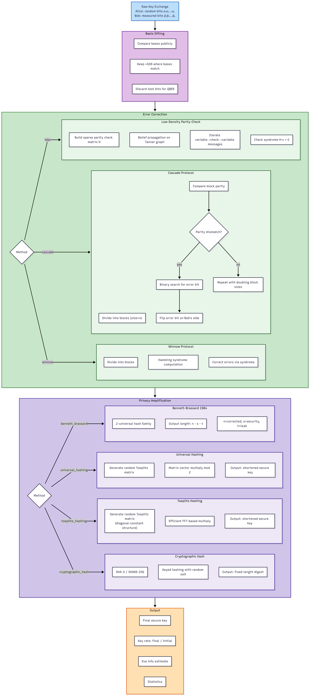
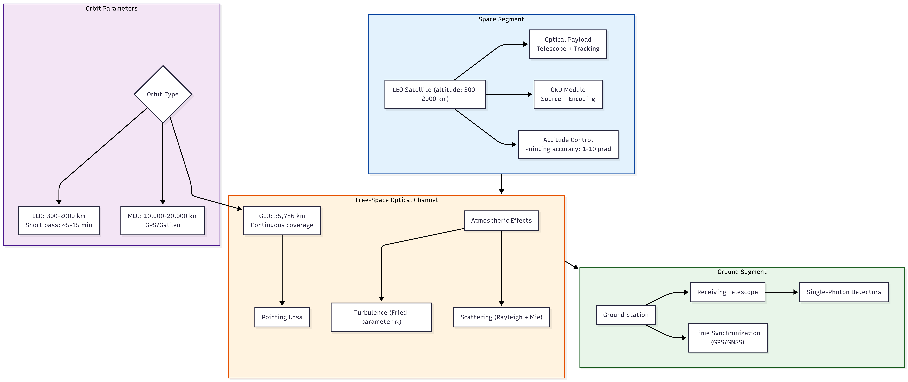
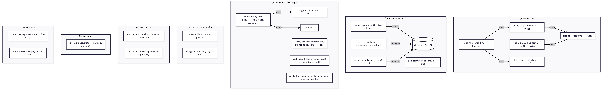

# QKDpy: Quantum Key Distribution Library

<div align="center">

[](https://opensource.org/licenses/Apache-2.0)
[](https://www.python.org/downloads/)
[](#-quick-start)
[](https://github.com/astral-sh/ruff)
[](https://github.com/Pranava-Kumar/qkdpy/releases)
[](https://pranava-kumar.github.io/qkdpy/)

**A Python library for Quantum Key Distribution simulation at the intersection of Space Technology, Quantum Computing, AI/ML, and config audit tooling**

> ⚠️ **This is a simulation / educational library, not a production cryptographic system.**
> QKDpy models QKD protocols, channels, and attacks with *phenomenological*
> approximations. It is **not** validated for securing real key material, and
> its channel/noise/error-correction models are simplified. Do **not** use it to
> generate or protect production secrets. See [Status & Scope](#-status--scope)
> for the precise maturity level.

[Features](#-features) • [Status & Scope](#-status--scope) • [Satellite QKD](#-satellite-qkd) • [ML Integration](#-ml-integration) • [Observability](#-observability--instrumentation) • [Product Tiers](#-product-tiers) • [Quantum-Safe Migration](#-quantum-safe-migration-toolkit) • [Quick Start](#-quick-start)

</div>

---

## 🏗️ Architecture Overview

> Detailed architecture diagrams are available in [`docs/diagrams/`](docs/diagrams/). Each diagram below is a high-level summary — click through to the linked file for full detail.

### High-Level Module Architecture

The system is organized into 9 modular layers. Arrows represent dependency direction.


*[Full diagram →](docs/diagrams/01-high-level-architecture.md) — complete module breakdown with dependency graph and directory structure*

### Protocol Execution Flow

All QKD protocols follow a template-method pattern defined in `BaseProtocol.execute()`:


*[Full diagram →](docs/diagrams/02-protocol-execution-flow.md) — BB84, E91, and CV-QKD sequence diagrams with detailed state transitions*

| Phase | Description |
|-------|-------------|
| **1. State Preparation** | Alice encodes random bits in random bases (computational, hadamard, circular) |
| **2. Quantum Transmission** | Qubits sent through `QuantumChannel` with configurable noise, loss, and eavesdropping |
| **3. Measurement** | Bob measures received qubits in random bases |
| **4. Basis Sifting** | Alice & Bob compare bases publicly, keep matching results (~50%) |
| **5. QBER Estimation** | Sample of sifted key compared publicly; abort if above threshold |
| **6. Error Correction** | Cascade/Winnow/LDPC to reconcile discrepancies |
| **7. Privacy Amplification** | Universal/Toeplitz hashing to remove Eve's partial information |

### Core Quantum Stack


*[Full diagram →](docs/diagrams/03-core-quantum-stack.md) — class hierarchy, Bloch sphere, noise models, security analysis*

| Component | Role |
|-----------|------|
| `Qubit` | Single qubit statevector `[α, β]` with gate application, measurement, Bloch sphere |
| `Qudit` | d-dimensional quantum system with unitary operations and partial trace |
| `DensityMatrix` | Mixed-state representation via density operator ρ — CPTP maps, von Neumann entropy, Uhlmann fidelity, partial trace *(new in v0.8.0)* |
| `Circuit` | Gate-sequence composition with method-chaining API, `simulate()`, OpenQASM 2.0 export *(new in v0.8.0)* |
| `MultiQubitState` | n-qubit statevector with entanglement entropy, GHZ/W-state preparation |
| `QuantumGate` | 18 gate implementations: Pauli, Hadamard, rotation, CNOT, CZ, SWAP, etc. |
| `CPTPChannel` | Completely Positive Trace-Preserving channel framework via Kraus operators, Choi matrix, diamond norm *(new in v0.8.0)* |
| `QuantumChannel` | Physical channel with loss, noise, eavesdropping, and atmospheric effects |
| `Measurement` | Basis measurement, tomography, fidelity, purity, entanglement witnesses |

### Key Management Pipeline



*[Full diagram →](docs/diagrams/04-key-management-pipeline.md) — Cascade protocol, LDPC belief propagation, Toeplitz hashing details*

| Stage | Methods | Output |
|-------|---------|--------|
| Error Correction | Cascade, Winnow, LDPC, BCH, Reed-Solomon | Identical reconciled keys |
| Privacy Amplification | Universal Hashing, Toeplitz, Cryptographic Hash, Bennett-Brassard | Shortened secure key |

### Network & Satellite QKD



*[Full diagram →](docs/diagrams/05-network-satellite-qkd.md) — pass simulation, multi-party network, routing*

### Framework Integrations


*[Full diagram →](docs/diagrams/06-integration-layer.md) — Qiskit, PennyLane, Cirq, QpiAI conversion flows*

### Cryptographic & Enterprise Module



*[Full diagram →](docs/diagrams/07-crypto-enterprise.md) — QuantumHash, ZK proofs, HSM, compliance, audit*

### ML Optimization Pipeline


*[Full diagram →](docs/diagrams/08-ml-optimization.md) — Bayesian/genetic optimization, neural prediction, edge deployment*

### End-to-End Data Flow


*[Full diagram →](docs/diagrams/09-data-flow.md) — input→output trace, type conversions, key sizes, instrumentation*

### API Surface & Usage Patterns


*[Full diagram →](docs/diagrams/10-api-surface.md) — public API overview, sequence diagrams, import map, configuration system*

---

## 📌 Status & Scope

**Maturity:** Research / educational simulation — **not** a production-grade or
security-validated QKD system.

QKDpy is suitable for:
- Learning how QKD protocols work and comparing them
- Modeling channel loss, noise, turbulence, and eavesdropping qualitatively
- Enterprise-architecture evaluation (licensing, compliance, audit tooling)
- Protocol and ML-optimization research

QKDpy is **not** suitable for:
- Generating or protecting real production key material
- Validating the security of an actual QKD deployment (QBER is not physically
  rigorous; channel models are phenomenological, not quantum-optics solvers)
- Relying on the LDPC error-correction path for a hardened, standards-compliant
  codec (it uses a simplified belief-propagation path with fallbacks)
- Treating the enterprise licensing as an anti-piracy / entitlement system (it
  is a demo gate; opt-in key verification is a demonstration mechanism, not a
  full license server)

Known-limitation tracking lives in [docs/OPEN_CORE.md](docs/OPEN_CORE.md) and
the release notes ([CHANGELOG.md](CHANGELOG.md)).

## 🌟 Highlights

| Domain                   | Capabilities                                                                               |
| ------------------------ | ------------------------------------------------------------------------------------------ |
| **🚀 Space Technology**  | Satellite-ground QKD, free-space optical channels, orbital mechanics, atmospheric modeling |
| **⚛️ Quantum Computing** | 12+ QKD protocols (BB84, E91, CV-QKD, HD-QKD, MDI-QKD, DI-QKD), density-matrix simulation, circuit composition, CPTP channel framework |
| **🤖 AI/ML**             | Bayesian optimization, neural network predictors, anomaly detection, adaptive protocols |

---

## 🛰️ Satellite QKD

QKDpy includes a comprehensive **Satellite Quantum Key Distribution** module for simulating space-ground quantum links:

```python
from qkdpy.network import SatelliteQKD, AtmosphericProfile, OrbitType

# Create a LEO satellite QKD system
sat_qkd = SatelliteQKD(
    orbit_type=OrbitType.LEO,
    altitude_km=500,
    ground_station_lat=28.5,   # Cape Canaveral
    ground_station_lon=-80.6,
)

# Simulate a satellite pass with atmospheric effects
atmosphere = AtmosphericProfile(
    visibility_km=23.0,
    turbulence_cn2=1e-14,
    aerosol_optical_depth=0.1,
)

results = sat_qkd.simulate_pass(
    duration_seconds=300,
    atmosphere=atmosphere,
)

print(f"Total key bits: {results['total_key_bits']:,.0f}")
print(f"Peak elevation: {max(results['elevation_angles']):.1f}°")
```

**Features:**

- 🌍 **Orbital Mechanics**: LEO/MEO/GEO orbit simulation with realistic slant range
- 🌫️ **Atmospheric Effects**: Rayleigh/Mie scattering, turbulence (Fried parameter), clouds
- 📡 **Free-Space Optical Channel**: Geometric spreading, pointing loss, beam wandering
- 🧠 **ML Channel Prediction**: Train models to predict optimal transmission windows

---

## 🤖 ML Integration

Optimize QKD performance with built-in machine learning:

```python
from qkdpy import QKDOptimizer, EfficientQKDPredictor

# Bayesian optimization for protocol parameters
optimizer = QKDOptimizer("BB84")
results = optimizer.optimize_channel_parameters(
    {"loss": (0.0, 0.5), "noise_level": (0.0, 0.1)},
    objective_function,
    method="bayesian",  # or "genetic", "neural"
)

# Resource-efficient predictor for edge deployment
predictor = EfficientQKDPredictor(
    input_dim=5,
    max_memory_mb=128,  # Constrained for embedded systems
    enable_quantization=True,
    enable_pruning=True,
)
```

---

## 🔍 Observability & Instrumentation

QKDpy includes built-in structured observability for debugging, performance analysis, and operations telemetry:

```python
from qkdpy.utils import OperationSpan, instrument, record_protocol_execution

# Context manager for timing any block
with OperationSpan("protocol.execute", protocol="BB84") as span:
    result = protocol.run()
    span.set_metadata(qber=result.qber)

# Decorator for automatic instrumentation
@instrument("ml.train")
def train_model(self, data):
    ...

# One-shot event recording
record_protocol_execution(
    protocol_name="BB84",
    key_length=256,
    qber=0.025,
    final_key_size=192,
    is_secure=True,
    duration_ms=145.2,
)
```

**Features:**
- **OperationSpan** — Context manager with automatic duration tracking and structured start/complete/failure events
- **@instrument decorator** — One-line function instrumentation with argument metadata capture
- **record_* helpers** — Domain-specific events for protocol execution, ML training, and QBER diagnostics
- **structlog backend** — JSON output for log aggregation (ELK, Datadog) or pretty-printed console

---

## 🔐 Quantum-Safe Migration Toolkit

**PREMIUM-tier** toolkit for assessing and planning migration to quantum-resistant cryptography:

```python
from qkdpy.enterprise.quantum_safe import (
    classic_enterprise_profile,
    generate_roadmap,
    QuantumSafeAssessment,
)

# Generate a crypto inventory from a classic enterprise profile
inventory = classic_enterprise_profile()
print(f"Total assets: {inventory.total_assets}")
print(f"Risk score: {inventory.risk_score:.0%}")

# Generate a phased migration roadmap
roadmap = generate_roadmap(inventory)
summary = roadmap.get_summary()
print(f"Target completion: {summary['target_completion']}")
print(f"Total steps: {summary['total_steps']}")

# Full assessment with recommendations
assessment = QuantumSafeAssessment(
    inventory=inventory,
    roadmap=roadmap,
)
report = assessment.to_dict()
for rec in report["recommendations"]:
    print(f"- {rec}")
```

**Migration phases:** Assess → Plan → Pilot → Migrate → Verify

---

## 📦 Features

### Protocols

- **BB84** (Standard + Decoy-State)
- **E91** (Entanglement-based, CHSH test)
- **B92**, **SARG04**, **SixState**
- **CV-QKD** (Continuous-Variable, with enhanced security analysis)
- **Device-Independent QKD** (DI-QKD)
- **HD-QKD** (High-Dimensional)
- **MDI-QKD** (Measurement-Device-Independent)
- **TwistedPairQKD** (Three-basis protocol)
- **FiniteKeyAnalysis** (Finite-key security bounds)
- **SecretKeyRate** calculator (key rates for BB84, decoy BB84, E91, SARG04, CV-QKD)

### Core Quantum Stack

- **DensityMatrix** — Mixed-state simulation via density operator ρ, CPTP maps, von Neumann entropy, Uhlmann fidelity, partial trace
- **Circuit** — Quantum circuit composition with method chaining, `simulate()`, OpenQASM 2.0 export
- **CPTPChannel** — Kraus-operator channel framework, Choi matrix, diamond norm, standard noise channels
- **Key Distillation Pipeline** — Cascade, Winnow, LDPC error correction; universal/Toeplitz hashing privacy amplification

### Enterprise

> **Honesty note:** The enterprise module provides *experimental* infrastructure
> for config auditing, key escrow, and HSM integration. It is **not** a
> production-grade security system — see [Product Tiers](#-product-tiers) for
> the detailed scope and limitations.

- **Product Tier Licensing** — FREE/ENTERPRISE/PREMIUM with cumulative features (tier gating is a demo mechanism; license-key verification added in v0.6.6)
- **Config Audit** — ETSI GS QKD 014/016, ISO/IEC 23837, NIST SP 800-57, FIPS 140-2, ISO 27001 (*internal audit only*, no external certification)
- **HSM Interface** — PKCS#11 interface with software simulation fallback
- **Audit Logging** — Tamper-evident, structured event logging
- **Quantum-Safe Migration** — Crypto inventory, risk assessment, phased migration roadmap
- **Key Escrow** — Secure key recovery for enterprise deployments

### Observability

- **OperationSpan** — Context manager for timed, structured operation tracking
- **@instrument decorator** — One-line function instrumentation
- **Domain-specific events** — Protocol execution, ML training, QBER diagnostics
- **structlog backend** — JSON or console output
- **Correlation IDs** — Trace operations across components

### Framework Integrations

- **Qiskit** — IBM quantum SDK integration with noise models and transpilation
- **Cirq** — Google quantum framework including E91 protocol
- **PennyLane** — Quantum ML integration with noisy mixed-state simulation
- **QpiAI** — QpiAI Quantum SDK integration with statevector sampling

### Infrastructure

- Structured exception hierarchy (`QKDException`)
- Centralized configuration management
- Structured logging with `structlog`
- Input validation decorators
- Type-safe (strict `mypy`)
- Density-matrix simulation engine (exact CPTP maps, no Monte Carlo approximation)
- Secure CSPRNG throughout (audited, no numpy global RNG)

---

## 🚀 Quick Start

```bash
# Install with uv (recommended)
pip install uv
uv pip install qkdpy

# Or with optional features
uv pip install qkdpy[ml]           # ML optimization
uv pip install qkdpy[enterprise]   # Enterprise features
uv pip install qkdpy[cirq]         # Cirq framework integration
uv pip install qkdpy[pennylane]    # PennyLane ML integration
uv pip install qkdpy[qiskit]       # Qiskit integration (noise models, transpilation)
uv pip install qkdpy[qpiai]        # QpiAI Quantum SDK integration
uv pip install qkdpy[all]          # Everything
```

```python
from qkdpy import BB84, QuantumChannel

# Create channel and protocol
channel = QuantumChannel(loss=0.1, noise_model='depolarizing', noise_level=0.02)
bb84 = BB84(channel, key_length=256)

# Execute protocol
results = bb84.execute()
print(f"Key: {results['final_key'][:32]}...")
print(f"QBER: {results['qber']:.2%}")
print(f"Secure: {results['is_secure']}")
```

Density-matrix simulation for mixed states and noise analysis:

```python
from qkdpy.core.density_matrix import DensityMatrix

# Create a maximally mixed single-qubit state
rho = DensityMatrix.maximally_mixed(2)
print(f"Purity: {rho.purity():.4f}")    # 0.5
print(f"Entropy: {rho.entropy():.4f}")  # 1.0

# Apply a depolarizing channel
depolarized = rho.apply_channel(DensityMatrix.depolarizing(1, p=0.1))

# Compute fidelity with reference state
ideal = DensityMatrix.from_pure([1.0, 0.0])
print(f"Fidelity: {DensityMatrix.fidelity(depolarized, ideal):.4f}")

# Quantum circuit composition (v0.8.0)
from qkdpy.core.circuit import Circuit

qc = Circuit(2)
qc.h(0).cx(0, 1).measure_all()  # Bell state
print(f"Depth: {qc.depth()}, Ops: {qc.count_ops()}")
print(qc.to_qasm())              # OpenQASM 2.0 export
```

---

## 📐 Architecture Decisions

Key technical decisions are captured as Architecture Decision Records (ADRs):

| ADR | Decision |
|-----|----------|
| [ADR-001](docs/decisions/ADR-001-product-tier-licensing.md) | Product Tier Licensing Model (FREE/ENTERPRISE/PREMIUM) |
| [ADR-002](docs/decisions/ADR-002-observability-and-instrumentation.md) | Observability via structlog + OperationSpan |
| [ADR-003](docs/decisions/ADR-003-compliance-architecture.md) | Pluggable Config Audit Architecture |
| [ADR-004](docs/decisions/ADR-004-enterprise-hsm-is-software-simulation.md) | HSM is a software simulation (honesty fix) |
| [ADR-005](docs/decisions/ADR-005-core-quantum-simulation-stack.md) | Core quantum simulation stack (DensityMatrix + Circuit) |
| [ADR-006](docs/decisions/ADR-006-protocol-execution-model.md) | Protocol execution model (template method) |

---

## 🏷️ Product Tiers

> **Honesty notice:** The enterprise tier is a *demo gate* — it gates access to experimental
> modules but is **not** a production entitlement or anti-piracy system. Opt-in license-key
> verification was added in v0.6.6. The "compliance standards" listed below are references
> used by the config audit module, **not** external certifications.

QKDpy uses a cumulative three-tier licensing model. Each tier includes everything in the tiers below it.

### Tier Comparison

| Feature | FREE | ENTERPRISE | PREMIUM |
|---------|:----:|:----------:|:-------:|
| All QKD Protocols | ✅ | ✅ | ✅ |
| Satellite QKD Simulation | ✅ | ✅ | ✅ |
| ML Integration & Optimization | ✅ | ✅ | ✅ |
| Advanced Visualization | ✅ | ✅ | ✅ |
| **Config Audit** (ETSI, NIST, FIPS, ISO) | — | ✅ | ✅ |
| **HSM Interface** (PKCS#11 / software sim) | — | ✅ | ✅ |
| **Audit Logging** | — | ✅ | ✅ |
| **ML-Based Attack Detection** | — | ✅ | ✅ |
| **Key Escrow** | — | ✅ | ✅ |
| **Config Audit HTML Export** | — | ✅ | ✅ |
| **Quantum-Safe Migration Toolkit** | — | — | ✅ |
| **Crypto Inventory Assessment** | — | — | ✅ |
| **Priority Support** | — | — | ✅ |

### Enterprise Suite

```python
from qkdpy.enterprise import (
    HSMInterface,
    AuditLogger,
    ConfigAudit,
    ComplianceStandard,
)

# Hardware Security Module interface (software simulation by default)
hsm = get_hsm(provider=HSMProvider.SOFTWARE)  # or PKCS11 (experimental)
key_handle = hsm.generate_key("session_key", key_length=256)

# Tamper-evident audit logging
audit = AuditLogger(storage_path="audit.log")
audit.log_key_event(AuditEventType.KEY_GENERATED, "session_key")

# Config audit against standards (NIST, FIPS, ISO, ETSI) — a config audit, not
# an external compliance certification.
checker = ConfigAudit([ComplianceStandard.NIST_SP_800_57])
report = checker.check_compliance()
print(report.export_markdown())
print(report.export_html())  # Enterprise-gated feature
```

Set your product tier via environment or config:

```python
import os
os.environ["QKDPY_PRODUCT_TIER"] = "enterprise"

from qkdpy import set_config
set_config(product_tier="enterprise")
```

### Compliance Standards (config audit references)

These standards are used by the config audit module for *internal* checking — they
are **not** external certifications the library or its users have obtained.

| Standard | Description |
|----------|-------------|
| **ETSI GS QKD 014** | KME-SA Interface (key delivery, authentication, status) |
| **ETSI GS QKD 016** | Common Criteria Protection Profile (security target, audit) |
| **ISO/IEC 23837-1/2** | QKD Security Requirements (key length, QBER thresholds) |
| **NIST SP 800-57** | Key Management (key length, algorithm lifetime) |
| **FIPS 140-2/140-3** | Cryptographic Module (approved algorithms, module integrity) |
| **ISO 27001** | Information Security (access control, logging, crypto policy) |

---

## 🎯 Career Relevance

This library demonstrates expertise at the intersection of:

| Space Technology             | Quantum Computing            | AI/ML                     |
| ---------------------------- | ---------------------------- | ------------------------- |
| Satellite orbital mechanics  | Qubit/qudit state simulation | Bayesian optimization     |
| Free-space optical links     | QKD protocol implementation  | Neural network prediction |
| Atmospheric channel modeling | Entanglement distribution    | Anomaly detection         |
| Ground station networks      | Error correction codes       | Adaptive parameter tuning |

**Real-world applications:**

- 🛰️ Quantum satellite missions (like China's Micius)
- 🏦 Enterprise quantum-safe communications
- 🔬 Research in quantum networks

---

## 📄 License

Apache License 2.0 - See [LICENSE](LICENSE)

## 👤 Author

**Pranava Kumar** - Quantum Computing & Space Technology Enthusiast

---

<div align="center">

_Building the future of secure space communications through quantum technology_

</div>
