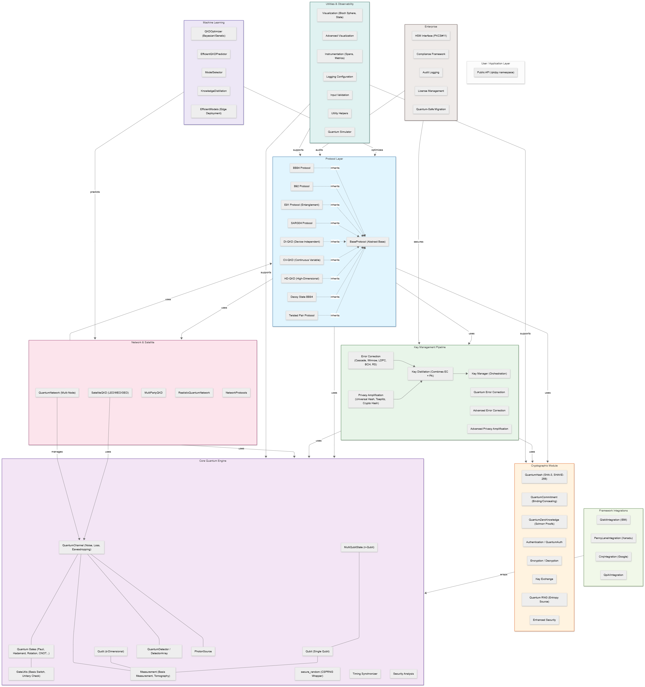
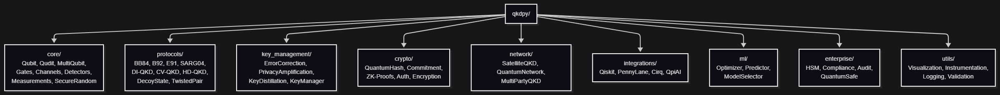

# 1. High-Level Architecture

graph TB
    subgraph User["User / Application Layer"]
        API["Public API (qkdpy namespace)"]
    end

    subgraph Protocols["Protocol Layer"]
        BB84["BB84 Protocol"]
        B92["B92 Protocol"]
        E91["E91 Protocol (Entanglement)"]
        SARG04["SARG04 Protocol"]
        DI_QKD["DI-QKD (Device-Independent)"]
        CV_QKD["CV-QKD (Continuous Variable)"]
        HD_QKD["HD-QKD (High-Dimensional)"]
        DECOY["Decoy State BB84"]
        TWISTED["Twisted Pair Protocol"]
        BASE["BaseProtocol (Abstract Base)"]
        BB84 -.->|inherits| BASE
        B92 -.->|inherits| BASE
        E91 -.->|inherits| BASE
        SARG04 -.->|inherits| BASE
        DI_QKD -.->|inherits| BASE
        CV_QKD -.->|inherits| BASE
        HD_QKD -.->|inherits| BASE
        DECOY -.->|inherits| BASE
        TWISTED -.->|inherits| BASE
    end

    subgraph Core["Core Quantum Engine"]
        QUBIT["Qubit (Single Qubit)"]
        QUDIT["Qudit (d-Dimensional)"]
        MULTI["MultiQubitState (n-Qubit)"]
        GATES["Quantum Gates (Pauli, Hadamard, Rotation, CNOT...)"]
        GATE_UTILS["GateUtils (Basis Switch, Unitary Check)"]
        CHANNEL["QuantumChannel (Noise, Loss, Eavesdropping)"]
        MEASURE["Measurement (Basis Measurement, Tomography)"]
        DETECTOR["QuantumDetector / DetectorArray"]
        PHOTON["PhotonSource"]
        SECURE_RNG["secure_random (CSPRNG Wrapper)"]
        TIMING["Timing Synchronizer"]
        SEC_ANALYSIS["Security Analysis"]

        QUBIT --- MEASURE
        QUDIT --- MEASURE
        MULTI --- QUBIT
        GATES --- GATE_UTILS
        CHANNEL --- GATES
        CHANNEL --- MEASURE
        CHANNEL --- DETECTOR
        CHANNEL --- PHOTON
    end

    subgraph KeyMgmt["Key Management Pipeline"]
        EC["Error Correction (Cascade, Winnow, LDPC, BCH, RS)"]
        PA["Privacy Amplification (Universal Hash, Toeplitz, Crypto Hash)"]
        KD["Key Distillation (Combines EC + PA)"]
        KM["Key Manager (Orchestration)"]
        QEC["Quantum Error Correction"]
        ADV_EC["Advanced Error Correction"]
        ADV_PA["Advanced Privacy Amplification"]

        EC --> KD
        PA --> KD
        KD --> KM
    end

    subgraph Crypto["Cryptographic Module"]
        HASH["QuantumHash (SHA-3, SHAKE-256)"]
        COMMIT["QuantumCommitment (Binding/Concealing)"]
        ZK["QuantumZeroKnowledge (Schnorr Proofs)"]
        AUTH["Authentication / QuantumAuth"]
        ENC["Encryption / Decryption"]
        KEX["Key Exchange"]
        QRNG["Quantum RNG (Entropy Source)"]
        ENH_SEC["Enhanced Security"]
    end

    subgraph Network["Network & Satellite"]
        SAT["SatelliteQKD (LEO/MEO/GEO)"]
        QNET["QuantumNetwork (Multi-Node)"]
        MPQKD["MultiPartyQKD"]
        REAL_NET["RealisticQuantumNetwork"]
        PROTOCOLS["NetworkProtocols"]

        SAT -->|uses| CHANNEL
        QNET -->|manages| CHANNEL
    end

    subgraph Integrations["Framework Integrations"]
        QISKIT["QiskitIntegration (IBM)"]
        PL["PennyLaneIntegration (Xanadu)"]
        CIRQ["CirqIntegration (Google)"]
        QPIAI["QpiAIIntegration"]
    end

    subgraph ML["Machine Learning"]
        OPTIM["QKDOptimizer (Bayesian/Genetic)"]
        PREDICT["EfficientQKDPredictor"]
        MOD_SEL["ModelSelector"]
        KD_ML["KnowledgeDistillation"]
        EFF_MODELS["EfficientModels (Edge Deployment)"]
    end

    subgraph Enterprise["Enterprise"]
        HSM["HSM Interface (PKCS#11)"]
        COMPLIANCE["Compliance Framework"]
        AUDIT["Audit Logging"]
        LICENSING["License Management"]
        QUANTUM_SAFE["Quantum-Safe Migration"]
    end

    subgraph Utils["Utilities & Observability"]
        VIZ["Visualization (Bloch Sphere, State)"]
        ADV_VIZ["Advanced Visualization"]
        INSTR["Instrumentation (Spans, Metrics)"]
        LOGGING["Logging Configuration"]
        VALIDATION["Input Validation"]
        HELPERS["Utility Helpers"]
        SIMULATOR["Quantum Simulator"]
    end

    %% Cross-module relationships
    Protocols -->|uses| Core
    Protocols -->|uses| KeyMgmt
    Protocols -->|uses| Crypto
    Protocols -->|uses| Network
    KeyMgmt -->|uses| Crypto
    KeyMgmt -->|uses| Core
    Network -->|uses| Protocols
    Network -->|uses| Core
    Integrations -->|wraps| Core
    ML -->|optimizes| Protocols
    ML -->|predicts| Network
    Enterprise -->|secures| KeyMgmt
    Enterprise -->|audits| Protocols
    Utils -->|supports| Core
    Utils -->|supports| Protocols
    Utils -->|supports| Crypto

    style Protocols fill:#e1f5fe,stroke:#01579b
    style Core fill:#f3e5f5,stroke:#4a148c
    style KeyMgmt fill:#e8f5e9,stroke:#1b5e20
    style Crypto fill:#fff3e0,stroke:#e65100
    style Network fill:#fce4ec,stroke:#880e4f
    style Integrations fill:#f1f8e9,stroke:#33691e
    style ML fill:#ede7f6,stroke:#311b92
    style Enterprise fill:#efebe9,stroke:#3e2723
    style Utils fill:#e0f2f1,stroke:#004d40

## Module Dependency Graph

graph LR
    subgraph Layer1["Layer 1: Quantum Core"]
        CHANNEL_c["QuantumChannel"]
        QUBIT_c["Qubit/Qudit/MultiQubit"]
        GATES_c["Gates/GateUtils"]
        MEASURE_c["Measurement"]
    end

    subgraph Layer2["Layer 2: Protocols"]
        PROTO["BaseProtocol"]
        BB84_p["BB84"]
        E91_p["E91"]
        CV_p["CV-QKD"]
        HD_p["HD-QKD"]
    end

    subgraph Layer3["Layer 3: Post-Processing"]
        EC_pp["ErrorCorrection"]
        PA_pp["PrivacyAmplification"]
        KD_pp["KeyDistillation"]
    end

    subgraph Layer4["Layer 4: Applications"]
        NET["Network/Satellite"]
        ML["ML/Optimization"]
        ENTERPRISE["Enterprise/Security"]
    end

    Layer1 --> Layer2
    Layer2 --> Layer3
    Layer3 --> Layer4

    INTEG["Integrations (Qiskit/PennyLane/Cirq)"] -.->|wraps| Layer1

## Directory Structure

graph TD
    ROOT["qkdpy/"] --> CORE["core/ Qubit, Qudit, MultiQubit, Gates, Channels, Detectors, Measurements, SecureRandom"]
    ROOT --> PROTO["protocols/ BB84, B92, E91, SARG04, DI-QKD, CV-QKD, HD-QKD, DecoyState, TwistedPair"]
    ROOT --> KM["key_management/ ErrorCorrection, PrivacyAmplification, KeyDistillation, KeyManager"]
    ROOT --> CRYPTO["crypto/ QuantumHash, Commitment, ZK-Proofs, Auth, Encryption"]
    ROOT --> NET["network/ SatelliteQKD, QuantumNetwork, MultiPartyQKD"]
    ROOT --> INTEG["integrations/ Qiskit, PennyLane, Cirq, QpiAI"]
    ROOT --> ML_DIR["ml/ Optimizer, Predictor, ModelSelector"]
    ROOT --> ENT["enterprise/ HSM, Compliance, Audit, QuantumSafe"]
    ROOT --> UTILS["utils/ Visualization, Instrumentation, Logging, Validation"]

**Key Design Decisions:**

| Decision | Choice | Rationale |
|----------|--------|-----------|
| State representation | Statevector (not density matrix) | Simpler, faster for pure states; density matrix computed on demand |
| Randomness | CSPRNG (`secrets` module) | All cryptographic randomness uses secure entropy; never `numpy.random` for crypto |
| Error handling | `Either<ClientException, T>` not used (pure Python) | Exceptions propagate naturally; no Arrow dependency |
| Protocol orchestration | `BaseProtocol.execute()` template method | Consistent flow across all protocols: prepare → transmit → measure → sift → EC → PA |
| Integrations | Separate wrappers, not inheritance | Each framework (Qiskit, PennyLane) wrapped independently; no coupling |
| Noise simulation | Quantum trajectory (statevector unraveling) | Kraus operators applied stochastically; more efficient than full density matrix |
| Key management | Modular pipeline | EC and PA are independent, composable stages |
