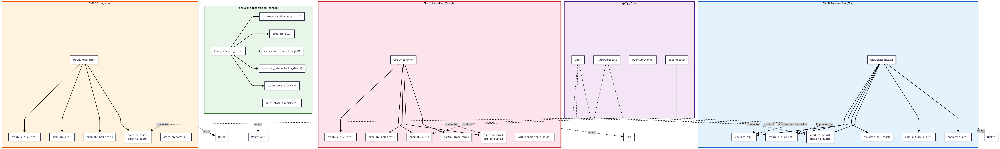
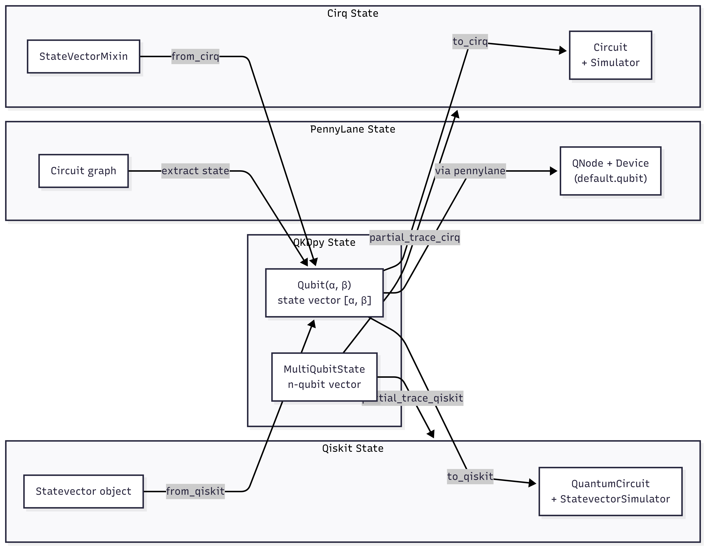

# 6. Integration Layer

## Framework Integration Architecture

graph TB
    subgraph QKDPY["QKDpy Core"]
        QUBIT["Qubit"]
        MULTI["MultiQubitState"]
        CHANNEL["QuantumChannel"]
        PROTOCOLS["BaseProtocol"]
    end

    subgraph QISKIT["Qiskit Integration (IBM)"]
        QI["QiskitIntegration"]
        QI_CREATE["create_e91_circuit()"]
        QI_SIM["simulate_e91()"]
        QI_BELL["simulate_bell_test()"]
        QI_CONV["qubit_to_qiskit() qiskit_to_qubit()"]
        QI_PARTIAL["partial_trace_qiskit()"]
        QI_ENTROPY["entropy_qiskit()"]

        QI --> QI_CREATE
        QI --> QI_SIM
        QI --> QI_BELL
        QI --> QI_CONV
        QI --> QI_PARTIAL
        QI --> QI_ENTROPY
    end

    subgraph PENNYLANE["PennyLane Integration (Xanadu)"]
        PL["PennyLaneIntegration"]
        PL_CREATE["create_entanglement_circuit()"]
        PL_SIM["simulate_e91()"]
        PL_CHSH["chsh_correlation_strength()"]
        PL_TELEPORT["quantum_teleportation_demo()"]
        PL_STATE["quick_state_experiment()"]
        PL_QNODE["cached QNode for CHSH"]

        PL --> PL_CREATE
        PL --> PL_SIM
        PL --> PL_CHSH
        PL --> PL_TELEPORT
        PL --> PL_QNODE
    end

    subgraph CIRQ["Cirq Integration (Google)"]
        CI["CirqIntegration"]
        CI_CREATE["create_e91_circuit()"]
        CI_SIM["simulate_e91()"]
        CI_BELL["simulate_bell_test()"]
        CI_CONV["qubit_to_cirq() cirq_to_qubit()"]
        CI_PARTIAL["partial_trace_cirq()"]
        CI_NOISE["with_depolarizing_noise()"]

        CI --> CI_CREATE
        CI --> CI_SIM
        CI --> CI_BELL
        CI --> CI_CONV
        CI --> CI_PARTIAL
    end

    subgraph QPIAI["QpiAI Integration"]
        QP["QpiAIIntegration"]
        QP_CREATE["create_e91_circuit()"]
        QP_SIM["simulate_e91()"]
        QP_BELL["simulate_bell_test()"]
        QP_CONV["qubit_to_qpiai() qpiai_to_qubit()"]
        QP_STATE["state_preparation()"]

        QP --> QP_CREATE
        QP --> QP_SIM
        QP --> QP_BELL
        QP --> QP_CONV
    end

    QISKIT -.->|wraps| Qiskit
    PENNYLANE -.->|wraps| PennyLane
    CIRQ -.->|wraps| Cirq
    QPIAI -.->|wraps| QpiAI

    QUBIT -.->|converted| QI_CONV
    QUBIT -.->|converted| CI_CONV
    QUBIT -.->|converted| QP_CONV
    MULTI -.->|used by| QI_SIM
    MULTI -.->|used by| CI_SIM
    CHANNEL -.->|bypassed in simulation| QI_SIM
    PROTOCOLS -.->|implemented| QI_CREATE

    style QISKIT fill:#e3f2fd,stroke:#1565c0
    style PENNYLANE fill:#e8f5e9,stroke:#2e7d32
    style CIRQ fill:#fce4ec,stroke:#c62828
    style QPIAI fill:#fff3e0,stroke:#e65100
    style QKDPY fill:#f3e5f5,stroke:#4a148c

## Integration Conversion Flow

