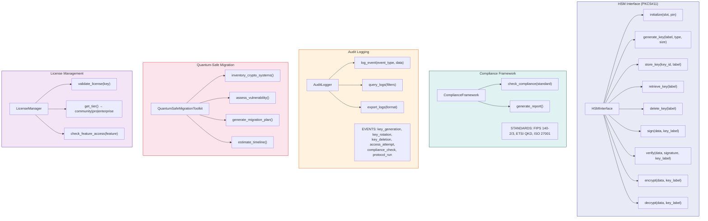

# 7. Cryptographic & Enterprise Module

## Cryptographic Module

```mermaid
graph TD
    subgraph QuantumHash["QuantumHash"]
        QH1["sha3_256_hash(data) → bytes"]
        QH2["shake_256_hash(data, length) → bytes"]
        QH3["quantum_hash(bits) → list[int]"]
        QH4["bits_to_bytes(bits) → bytes"]
        QH5["bytes_to_bits(bytes) → list[int]"]
        QH1 -->|uses| QH4
        QH2 -->|uses| QH4
        QH3 -->|uses| QH1
        QH3 -->|uses| QH5
    end

    subgraph QuantumCommitment["QuantumCommitment"]
        QC1["commit(value, salt) → (id, key)"]
        QC2["verify_commitment(id, value, salt, key) → bool"]
        QC3["open_commitment(id, key) → dict"]
        QC4["get_commitment_info(id) → dict"]
        QC1 -->|stores| MEM[("In-memory store")]
        QC2 -->|looks up| MEM
        QC3 -->|looks up| MEM
    end

    subgraph ZeroKnowledge["QuantumZeroKnowledge"]
        ZK1["schnorr_proof(secret, public) → (challenge, response)"]
        ZK2["verify_schnorr_proof(public, challenge, response) → bool"]
        ZK3["hash_based_commitment(value) → (commitment, path)"]
        ZK4["verify_hash_commitment(commitment, value, path) → bool"]

        ZK1 -->|uses| MOD["Large prime modulus: 2²⁵⁵-19"]
        ZK1 -->|uses| GEN["Generator: 2"]
    end

    subgraph Encryption["Encryption / Decryption"]
        ENC1["encrypt(data, key) → ciphertext"]
        DEC1["decrypt(ciphertext, key) → data"]
    end

    subgraph Auth["Authentication"]
        AUTH1["quantum_auth.authenticate(user, credentials)"]
        AUTH2["authentication.verify(message, signature)"]
    end

    subgraph KeyExchange["Key Exchange"]
        KEX1["key_exchange.protocol(party_a, party_b)"]
    end

    subgraph QRNG["Quantum RNG"]
        QRNG1["QuantumRNG.generate(num_bits) → list[int]"]
        QRNG2["QuantumRNG.entropy_source() → float"]
    end
```

## Enterprise Features

```mermaid
graph TD
    subgraph HSM["HSM Interface (PKCS#11)"]
        HSM1["HSMInterface"]
        HSM2["initialize(slot, pin)"]
        HSM3["generate_key(label, type, size)"]
        HSM4["store_key(key_id, label)"]
        HSM5["retrieve_key(label)"]
        HSM6["delete_key(label)"]
        HSM7["sign(data, key_label)"]
        HSM8["verify(data, signature, key_label)"]
        HSM9["encrypt(data, key_label)"]
        HSM10["decrypt(data, key_label)"]

        HSM1 --> HSM2
        HSM1 --> HSM3
        HSM1 --> HSM4
        HSM1 --> HSM5
        HSM1 --> HSM6
        HSM1 --> HSM7
        HSM1 --> HSM8
        HSM1 --> HSM9
        HSM1 --> HSM10
    end

    subgraph Compliance["Compliance Framework"]
        C1["ComplianceFramework"]
        C2["check_compliance(standard)"]
        C3["generate_report()"]
        C4["STANDARDS: FIPS 140-2/3, ETSI QKD, ISO 27001"]
        C1 --> C2
        C1 --> C3
    end

    subgraph Audit["Audit Logging"]
        AL1["AuditLogger"]
        AL2["log_event(event_type, data)"]
        AL3["query_logs(filters)"]
        AL4["export_logs(format)"]
        AL5["EVENTS: key_generation, key_rotation,<br/>key_deletion, access_attempt,<br/>compliance_check, protocol_run"]
        AL1 --> AL2
        AL1 --> AL3
        AL1 --> AL4
    end

    subgraph QuantumSafe["Quantum-Safe Migration"]
        QS1["QuantumSafeMigrationToolkit"]
        QS2["inventory_crypto_systems()"]
        QS3["assess_vulnerability()"]
        QS4["generate_migration_plan()"]
        QS5["estimate_timeline()"]

        QS1 --> QS2
        QS1 --> QS3
        QS1 --> QS4
        QS1 --> QS5
    end

    subgraph Licensing["License Management"]
        LM1["LicenseManager"]
        LM2["validate_license(key)"]
        LM3["get_tier() → community|pro|enterprise"]
        LM4["check_feature_access(feature)"]

        LM1 --> LM2
        LM1 --> LM3
        LM1 --> LM4
    end

    style HSM fill:#e8eaf6,stroke:#283593
    style Compliance fill:#e0f2f1,stroke:#004d40
    style Audit fill:#fff3e0,stroke:#e65100
    style QuantumSafe fill:#fce4ec,stroke:#b71c1c
    style Licensing fill:#f3e5f5,stroke:#4a148c
```

## Product Tiers

```mermaid
flowchart LR
    subgraph COM["Community 🆓"]
        COM_F["• BB84, B92, E91 protocols"]
        COM_C["• Core quantum simulation"]
        COM_K["• Basic key management"]
        COM_V["• Visualization tools"]
    end

    subgraph PRO["Professional 💳"]
        PRO_F["• All community features"]
        PRO_C["• CV-QKD, HD-QKD, SARG04"]
        PRO_K["• Advanced error correction"]
        PRO_M["• ML optimizers"]
        PRO_I["• Framework integrations"]
    end

    subgraph ENT["Enterprise 🏢"]
        ENT_F["• All professional features"]
        ENT_C["• HSM interface (PKCS#11)"]
        ENT_K["• Compliance frameworks"]
        ENT_A["• Audit logging"]
        ENT_Q["• Quantum-safe migration"]
        ENT_S["• Satellite QKD simulation"]
        ENT_N["• Quantum network simulation"]
    end

    COM --> PRO --> ENT
```
