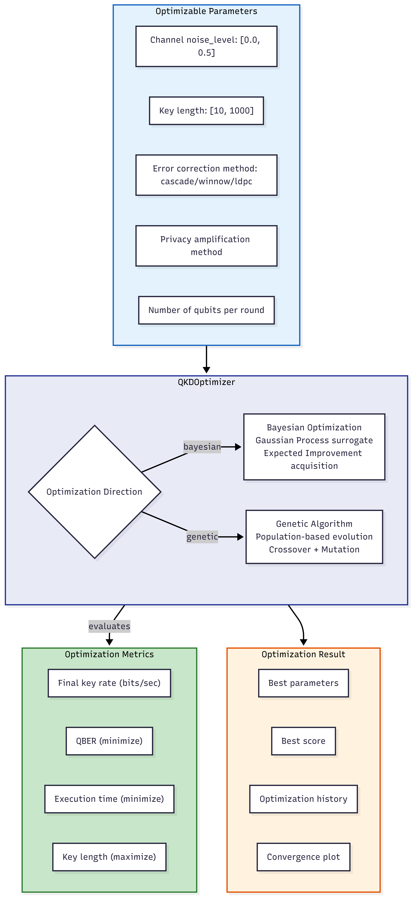
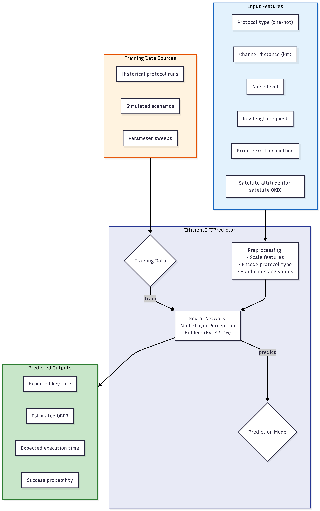
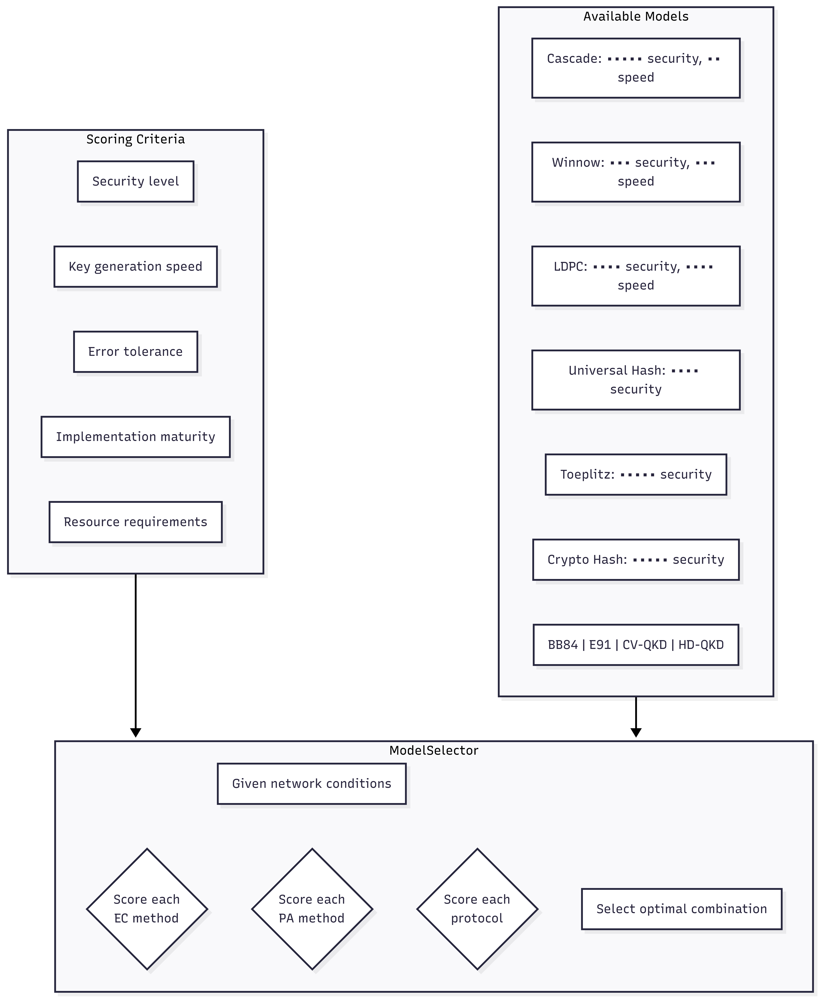
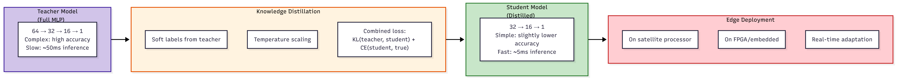
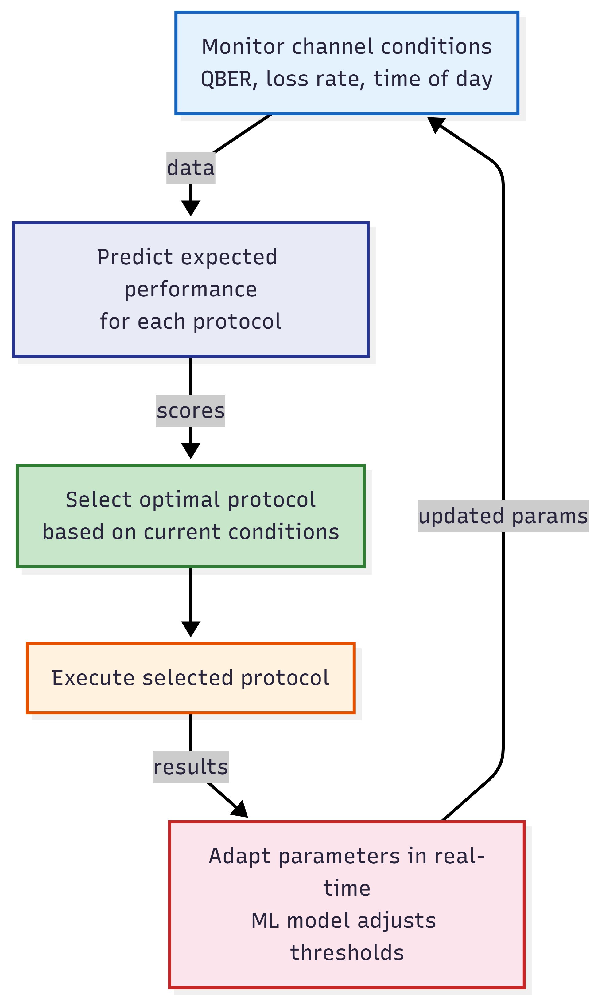

# 8. ML Optimization Pipeline

## QKD Optimizer Architecture

flowchart TD
    subgraph Optimizer["QKDOptimizer"]
        DIR{"Optimization Direction"}
        BAYES["Bayesian Optimization Gaussian Process surrogate Expected Improvement acquisition"]
        GENETIC["Genetic Algorithm Population-based evolution Crossover + Mutation"]

        DIR -->|bayesian| BAYES
        DIR -->|genetic| GENETIC
    end

    subgraph Parameters["Optimizable Parameters"]
        P1["Channel noise_level: [0.0, 0.5]"]
        P2["Key length: [10, 1000]"]
        P3["Error correction method: cascade/winnow/ldpc"]
        P4["Privacy amplification method"]
        P5["Number of qubits per round"]
    end

    subgraph Metrics["Optimization Metrics"]
        M1["Final key rate (bits/sec)"]
        M2["QBER (minimize)"]
        M3["Execution time (minimize)"]
        M4["Key length (maximize)"]
    end

    subgraph Result["Optimization Result"]
        R1["Best parameters"]
        R2["Best score"]
        R3["Optimization history"]
        R4["Convergence plot"]
    end

    Parameters --> Optimizer
    Optimizer -->|evaluates| Metrics
    Optimizer --> Result

    style Optimizer fill:#e8eaf6,stroke:#283593
    style Parameters fill:#e3f2fd,stroke:#1565c0
    style Metrics fill:#c8e6c9,stroke:#2e7d32
    style Result fill:#fff3e0,stroke:#e65100

## Efficient QKD Predictor

flowchart TD
    subgraph Predictor["EfficientQKDPredictor"]
        NN["Neural Network: Multi-Layer Perceptron Hidden: (64, 32, 16)"]
        PREPROC["Preprocessing: · Scale features · Encode protocol type · Handle missing values"]
        TRAIN{"Training Data"}
        PREDICT{"Prediction Mode"}

        TRAIN -->|train| NN
        NN -->|predict| PREDICT
    end

    subgraph Features["Input Features"]
        F1["Protocol type (one-hot)"]
        F2["Channel distance (km)"]
        F3["Noise level"]
        F4["Key length request"]
        F5["Error correction method"]
        F6["Satellite altitude (for satellite QKD)"]
    end

    subgraph Outputs["Predicted Outputs"]
        O1["Expected key rate"]
        O2["Estimated QBER"]
        O3["Expected execution time"]
        O4["Success probability"]
    end

    subgraph DataSource["Training Data Sources"]
        DS1["Historical protocol runs"]
        DS2["Simulated scenarios"]
        DS3["Parameter sweeps"]
    end

    Features --> PREPROC --> NN
    NN --> Outputs
    DataSource --> TRAIN

    style Predictor fill:#e8eaf6,stroke:#283593
    style Features fill:#e3f2fd,stroke:#1565c0
    style Outputs fill:#c8e6c9,stroke:#2e7d32
    style DataSource fill:#fff3e0,stroke:#e65100

## Model Selector

flowchart TD
    subgraph Selector["ModelSelector"]
        SEL_INPUT["Given network conditions"]
        SEL_EC{"Score each EC method"}
        SEL_PA{"Score each PA method"}
        SEL_PROTO{"Score each protocol"}
        SEL_OUTPUT["Select optimal combination"]
    end

    subgraph Scores["Scoring Criteria"]
        S1["Security level"]
        S2["Key generation speed"]
        S3["Error tolerance"]
        S4["Implementation maturity"]
        S5["Resource requirements"]
    end

    subgraph Models["Available Models"]
        M_EC1["Cascade: ••••• security, •• speed"]
        M_EC2["Winnow: ••• security, ••• speed"]
        M_EC3["LDPC: •••• security, •••• speed"]

        M_PA1["Universal Hash: •••• security"]
        M_PA2["Toeplitz: ••••• security"]
        M_PA3["Crypto Hash: ••••• security"]

        M_PROTO["BB84 | E91 | CV-QKD | HD-QKD"]
    end

    Scores --> Selector
    Models --> Selector
    Selector --> SEL_EC
    Selector --> SEL_PA
    Selector --> SEL_PROTO

## Knowledge Distillation for Edge Deployment

flowchart LR
    subgraph Teacher["Teacher Model (Full MLP)"]
        T["64 → 32 → 16 → 1 Complex: high accuracy Slow: ~50ms inference"]
    end

    subgraph Student["Student Model (Distilled)"]
        S["32 → 16 → 1 Simple: slightly lower accuracy Fast: ~5ms inference"]
    end

    subgraph Distill["Knowledge Distillation"]
        D1["Soft labels from teacher"]
        D2["Temperature scaling"]
        D3["Combined loss: KL(teacher, student) + CE(student, true)"]
    end

    subgraph Edge["Edge Deployment"]
        E1["On satellite processor"]
        E2["On FPGA/embedded"]
        E3["Real-time adaptation"]
    end

    Teacher --> Distill --> Student --> Edge

    style Teacher fill:#d1c4e9,stroke:#4527a0
    style Student fill:#c8e6c9,stroke:#2e7d32
    style Distill fill:#fff3e0,stroke:#e65100
    style Edge fill:#ffcdd2,stroke:#c62828

## Adaptive Protocol Selection

flowchart TD
    MON["Monitor channel conditions QBER, loss rate, time of day"]
    PRED["Predict expected performance for each protocol"]
    SELECT["Select optimal protocol based on current conditions"]
    EXEC["Execute selected protocol"]
    ADAPT["Adapt parameters in real-time ML model adjusts thresholds"]

    MON -->|data| PRED
    PRED -->|scores| SELECT
    SELECT --> EXEC
    EXEC -->|results| ADAPT
    ADAPT -->|updated params| MON

    style MON fill:#e3f2fd,stroke:#1565c0
    style PRED fill:#e8eaf6,stroke:#283593
    style SELECT fill:#c8e6c9,stroke:#2e7d32
    style EXEC fill:#fff3e0,stroke:#e65100
    style ADAPT fill:#fce4ec,stroke:#c62828
