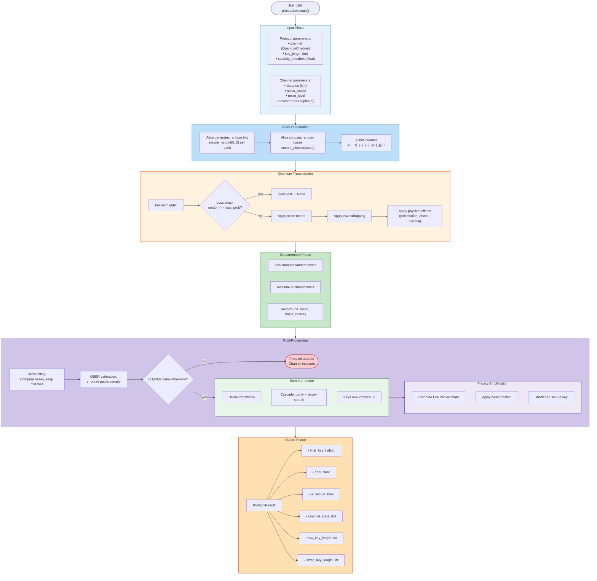
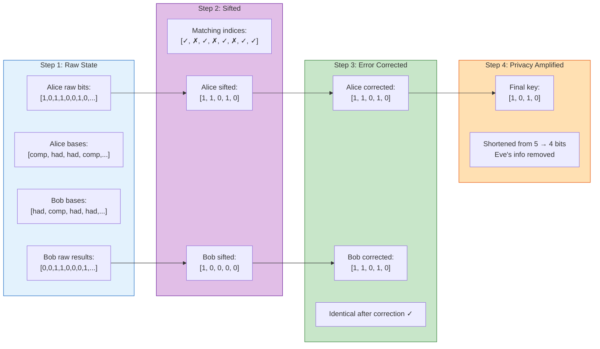
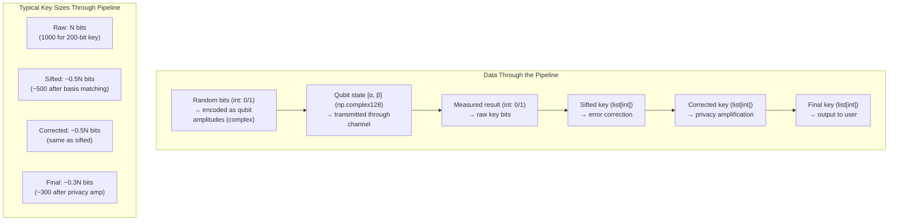

# 9. End-to-End Data Flow

## Complete QKD Pipeline: Input → Output

```mermaid
flowchart TD
    START(["User calls protocol.execute()"])

    subgraph Input["Input Phase"]
        IN1["Protocol parameters:<br/>• channel (QuantumChannel)<br/>• key_length (int)<br/>• security_threshold (float)"]
        IN2["Channel parameters:<br/>• distance (km)<br/>• noise_model<br/>• noise_level<br/>• eavesdropper (optional)"]
    end

    subgraph Prepare["State Preparation"]
        PR1["Alice generates random bits<br/>secure_randint(0, 2) per qubit"]
        PR2["Alice chooses random bases<br/>secure_choice(bases)"]
        PR3["Qubits created:<br/>|0⟩, |1⟩, |+⟩, |−⟩, |y+⟩, |y−⟩"]

        PR1 --> PR2 --> PR3
    end

    subgraph Transmit["Quantum Transmission"]
        TR1["For each qubit:"]
        TR2{"Loss check<br/>random() < loss_prob?"}
        TR3["Apply noise model"]
        TR4["Apply eavesdropping"]
        TR5["Apply physical effects<br/>(polarization, phase, thermal)"]

        TR1 --> TR2
        TR2 -->|yes| LOST["Qubit lost → None"]
        TR2 -->|no| TR3 --> TR4 --> TR5
    end

    subgraph Measure["Measurement Phase"]
        ME1["Bob chooses random bases"]
        ME2["Measure in chosen basis"]
        ME3["Record: (bit_result, basis_choice)"]
    end

    subgraph PostProc["Post-Processing"]
        PP1["Basis sifting:<br/>Compare bases, keep matches"]
        PP2["QBER estimation:<br/>errors in public sample"]
        PP3{"Is QBER below threshold?"}

        subgraph EC_PP["Error Correction"]
            EC1["Divide into blocks"]
            EC2["Cascade: parity + binary search"]
            EC3["Keys now identical ✓"]
        end

        subgraph PA_PP["Privacy Amplification"]
            PA1["Compute Eve info estimate"]
            PA2["Apply hash function"]
            PA3["Shortened secure key"]
        end

        PP1 --> PP2 --> PP3
        PP3 -->|yes| EC_PP --> PA_PP
        PP3 -->|no| ABORT(["Protocol aborted<br/>Channel insecure"])
    end

    subgraph Output["Output Phase"]
        OUT1["ProtocolResult:"]
        OUT2["• final_key: list[int]"]
        OUT3["• qber: float"]
        OUT4["• is_secure: bool"]
        OUT5["• channel_stats: dict"]
        OUT6["• raw_key_length: int"]
        OUT7["• sifted_key_length: int"]

        OUT1 --> OUT2
        OUT1 --> OUT3
        OUT1 --> OUT4
        OUT1 --> OUT5
        OUT1 --> OUT6
        OUT1 --> OUT7
    end

    START --> Input --> Prepare --> Transmit --> Measure --> PostProc --> Output

    style Input fill:#e3f2fd,stroke:#1565c0
    style Prepare fill:#bbdefb,stroke:#0d47a1
    style Transmit fill:#fff3e0,stroke:#e65100
    style Measure fill:#c8e6c9,stroke:#2e7d32
    style PostProc fill:#d1c4e9,stroke:#4527a0
    style EC_PP fill:#e8f5e9,stroke:#1b5e20
    style PA_PP fill:#ede7f6,stroke:#311b92
    style Output fill:#ffe0b2,stroke:#bf360c
    style ABORT fill:#ffcdd2,stroke:#b71c1c
```

## State Evolution Through Pipeline

```mermaid
flowchart LR
    subgraph S1["Step 1: Raw State"]
        ALICE_RAW["Alice raw bits:<br/>[1,0,1,1,0,0,1,0,...]"]
        ALICE_BASIS["Alice bases:<br/>[comp, had, had, comp,...]"]
        BOB_BASIS["Bob bases:<br/>[had, comp, had, had,...]"]
        BOB_RAW["Bob raw results:<br/>[0,0,1,1,0,0,0,1,...]"]
    end

    subgraph S2["Step 2: Sifted"]
        MATCH["Matching indices:<br/>[✓, ✗, ✓, ✗, ✓, ✗, ✓, ✓]"]
        ALICE_SIFT["Alice sifted:<br/>[1, 1, 0, 1, 0]"]
        BOB_SIFT["Bob sifted:<br/>[1, 0, 0, 0, 0]"]
    end

    subgraph S3["Step 3: Error Corrected"]
        ALICE_EC["Alice corrected:<br/>[1, 1, 0, 1, 0]"]
        BOB_EC["Bob corrected:<br/>[1, 1, 0, 1, 0]"]
        NOTE_EC["Identical after correction ✓"]
    end

    subgraph S4["Step 4: Privacy Amplified"]
        FINAL_KEY["Final key:<br/>[1, 0, 1, 0]"]
        NOTE_PA["Shortened from 5 → 4 bits<br/>Eve's info removed"]
    end

    ALICE_RAW --> ALICE_SIFT
    BOB_RAW --> BOB_SIFT
    ALICE_SIFT --> ALICE_EC
    BOB_SIFT --> BOB_EC
    ALICE_EC --> FINAL_KEY

    style S1 fill:#e3f2fd,stroke:#1565c0
    style S2 fill:#e1bee7,stroke:#6a1b9a
    style S3 fill:#c8e6c9,stroke:#2e7d32
    style S4 fill:#ffe0b2,stroke:#e65100
```

## Data Type Conversions

```mermaid
flowchart TD
    subgraph Types["Data Through the Pipeline"]
        T1["Random bits (int: 0/1)<br/>→ encoded as qubit amplitudes (complex)"]
        T2["Qubit state [α, β] (np.complex128)<br/>→ transmitted through channel"]
        T3["Measured result (int: 0/1)<br/>→ raw key bits"]
        T4["Sifted key (list[int])<br/>→ error correction"]
        T5["Corrected key (list[int])<br/>→ privacy amplification"]
        T6["Final key (list[int])<br/>→ output to user"]

        T1 --> T2 --> T3 --> T4 --> T5 --> T6
    end

    subgraph KeySizes["Typical Key Sizes Through Pipeline"]
        K1["Raw: N bits<br/>(1000 for 200-bit key)"]
        K2["Sifted: ~0.5N bits<br/>(~500 after basis matching)"]
        K3["Corrected: ~0.5N bits<br/>(same as sifted)"]
        K4["Final: ~0.3N bits<br/>(~300 after privacy amp)"]
    end
```

## Instrumentation & Observability

```mermaid
flowchart LR
    subgraph Events["Instrumented Events"]
        E1["OperationSpan:<br/>• protocol.execute.BB84<br/>• protocol.execute.E91<br/>• error_correction.cascade"]
        E2["record_protocol_execution()"]
        E3["record_qber_diagnostic()"]
    end

    subgraph Metrics["Collected Metrics"]
        M1["Protocol name"]
        M2["Key length (requested)"]
        M3["QBER value"]
        M4["Final key size"]
        M5["Is secure"]
        M6["Duration (ms)"]
        M7["Channel stats"]
    end

    subgraph OutputObs["Observability Output"]
        O1["Console logging"]
        O2["Structured metrics dict"]
        O3["Span hierarchy for debugging"]
    end

    Events --> Metrics --> OutputObs
```
