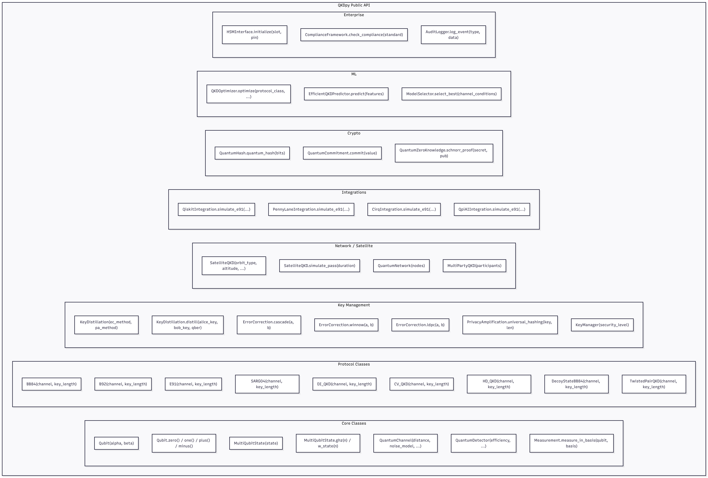
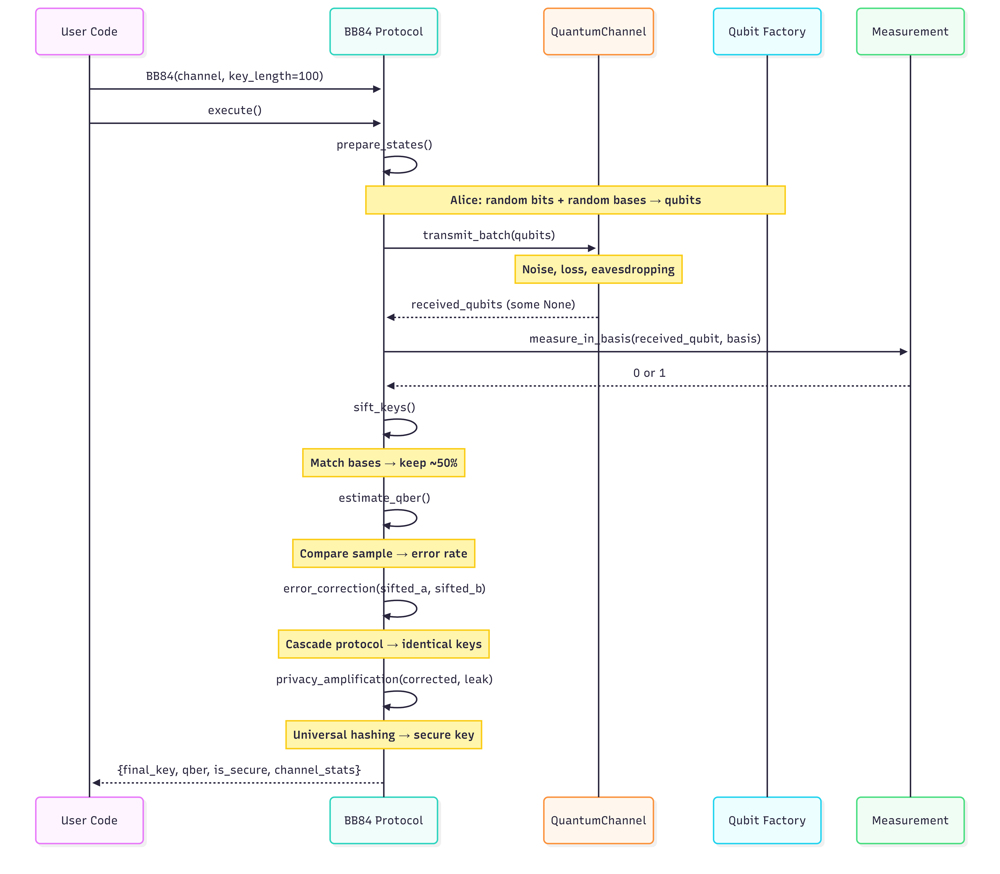
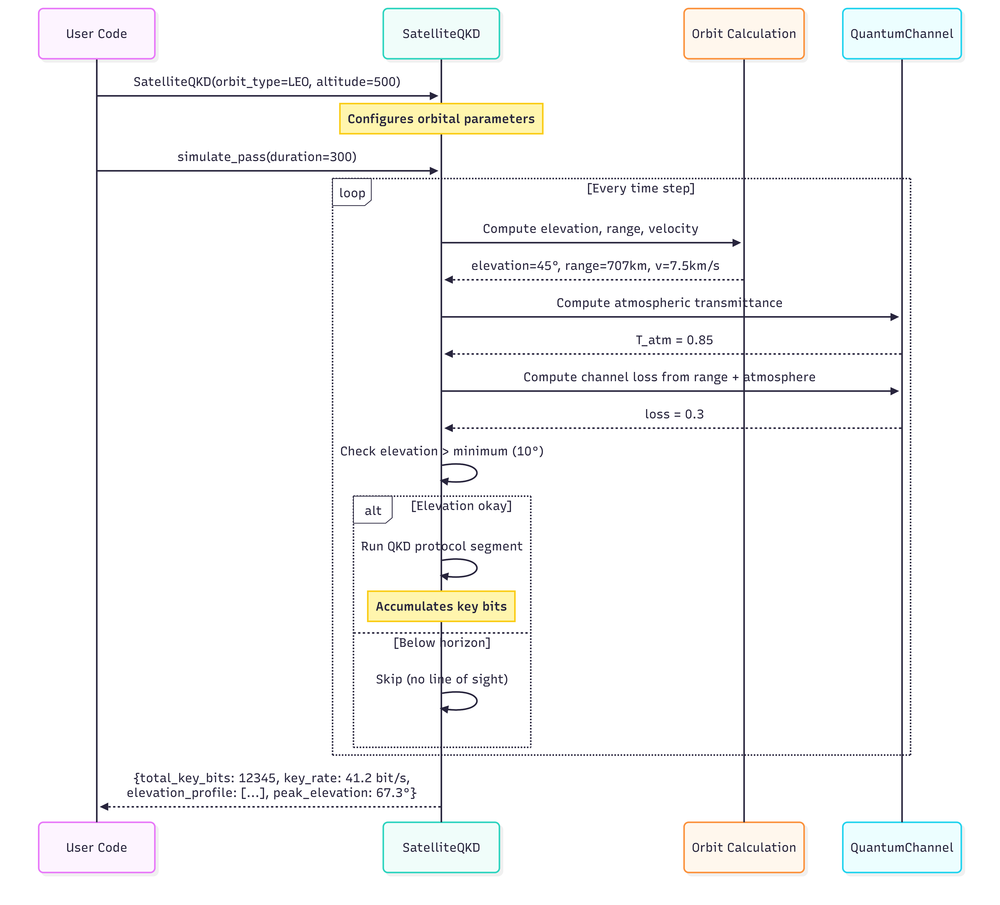
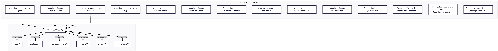
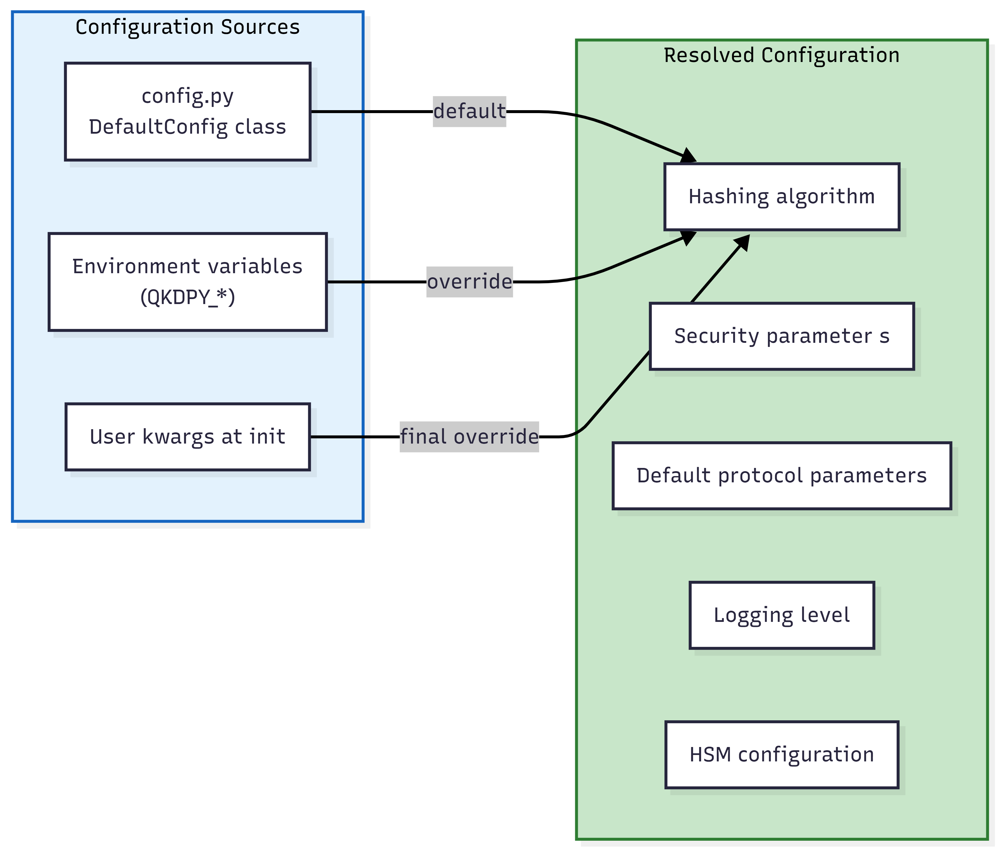

# 10. API Surface & Usage Patterns

## Public API Overview

graph TD
    subgraph PublicAPI["QKDpy Public API"]
        subgraph CoreAPI["Core Classes"]
            C1["Qubit(alpha, beta)"]
            C2["Qubit.zero() / one() / plus() / minus()"]
            C3["MultiQubitState(state)"]
            C4["MultiQubitState.ghz(n) / w_state(n)"]
            C5["QuantumChannel(distance, noise_model, ...)"]
            C6["QuantumDetector(efficiency, ...)"]
            C7["Measurement.measure_in_basis(qubit, basis)"]
        end

        subgraph ProtocolAPI["Protocol Classes"]
            P1["BB84(channel, key_length)"]
            P2["B92(channel, key_length)"]
            P3["E91(channel, key_length)"]
            P4["SARG04(channel, key_length)"]
            P5["DI_QKD(channel, key_length)"]
            P6["CV_QKD(channel, key_length)"]
            P7["HD_QKD(channel, key_length)"]
            P8["DecoyStateBB84(channel, key_length)"]
            P9["TwistedPairQKD(channel, key_length)"]
        end

        subgraph KeyMgmtAPI["Key Management"]
            K1["KeyDistillation(ec_method, pa_method)"]
            K2["KeyDistillation.distill(alice_key, bob_key, qber)"]
            K3["ErrorCorrection.cascade(a, b)"]
            K4["ErrorCorrection.winnow(a, b)"]
            K5["ErrorCorrection.ldpc(a, b)"]
            K6["PrivacyAmplification.universal_hashing(key, len)"]
            K7["KeyManager(security_level)"]
        end

        subgraph NetworkAPI["Network / Satellite"]
            N1["SatelliteQKD(orbit_type, altitude, ...)"]
            N2["SatelliteQKD.simulate_pass(duration)"]
            N3["QuantumNetwork(nodes)"]
            N4["MultiPartyQKD(participants)"]
        end

        subgraph IntegrationAPI["Integrations"]
            I1["QiskitIntegration.simulate_e91(...)"]
            I2["PennyLaneIntegration.simulate_e91(...)"]
            I3["CirqIntegration.simulate_e91(...)"]
            I4["QpiAIIntegration.simulate_e91(...)"]
        end

        subgraph CryptoAPI["Crypto"]
            CR1["QuantumHash.quantum_hash(bits)"]
            CR2["QuantumCommitment.commit(value)"]
            CR3["QuantumZeroKnowledge.schnorr_proof(secret, pub)"]
        end

        subgraph MLAPI["ML"]
            M1["QKDOptimizer.optimize(protocol_class, ...)"]
            M2["EfficientQKDPredictor.predict(features)"]
            M3["ModelSelector.select_best(channel_conditions)"]
        end

        subgraph EnterpriseAPI["Enterprise"]
            E1["HSMInterface.initialize(slot, pin)"]
            E2["ComplianceFramework.check_compliance(standard)"]
            E3["AuditLogger.log_event(type, data)"]
        end
    end

## Common Usage Pattern: BB84

sequenceDiagram
    participant User as User Code
    participant BB84 as BB84 Protocol
    participant Channel as QuantumChannel
    participant Qubit as Qubit Factory
    participant Meas as Measurement

    User->>BB84: BB84(channel, key_length=100)
    User->>BB84: execute()

    BB84->>BB84: prepare_states()
    Note over BB84,Qubit: Alice: random bits + random bases → qubits

    BB84->>Channel: transmit_batch(qubits)
    Note over Channel: Noise, loss, eavesdropping

    Channel-->>BB84: received_qubits (some None)

    BB84->>Meas: measure_in_basis(received_qubit, basis)
    Meas-->>BB84: 0 or 1

    BB84->>BB84: sift_keys()
    Note over BB84: Match bases → keep ~50%

    BB84->>BB84: estimate_qber()
    Note over BB84: Compare sample → error rate

    BB84->>BB84: error_correction(sifted_a, sifted_b)
    Note over BB84: Cascade protocol → identical keys

    BB84->>BB84: privacy_amplification(corrected, leak)
    Note over BB84: Universal hashing → secure key

    BB84-->>User: {final_key, qber, is_secure, channel_stats}

## Common Usage Pattern: Satellite QKD

sequenceDiagram
    participant User as User Code
    participant SAT as SatelliteQKD
    participant ORBIT as Orbit Calculation
    participant CH as QuantumChannel

    User->>SAT: SatelliteQKD(orbit_type=LEO, altitude=500)
    Note over SAT: Configures orbital parameters

    User->>SAT: simulate_pass(duration=300)

    loop Every time step
        SAT->>ORBIT: Compute elevation, range, velocity
        ORBIT-->>SAT: elevation=45°, range=707km, v=7.5km/s

        SAT->>CH: Compute atmospheric transmittance
        CH-->>SAT: T_atm = 0.85

        SAT->>CH: Compute channel loss from range + atmosphere
        CH-->>SAT: loss = 0.3

        SAT->>SAT: Check elevation > minimum (10°)
        alt Elevation okay
            SAT->>SAT: Run QKD protocol segment
            Note over SAT: Accumulates key bits
        else Below horizon
            SAT->>SAT: Skip (no line of sight)
        end
    end

    SAT-->>User: {total_key_bits: 12345, key_rate: 41.2 bit/s, elevation_profile: [...], peak_elevation: 67.3°}

## Package Import Map

graph TD
    subgraph Imports["Public Import Paths"]
        IMP1["from qkdpy import Qubit, Qudit"]
        IMP2["from qkdpy import QuantumChannel"]
        IMP3["from qkdpy import BB84, B92, E91"]
        IMP4["from qkdpy import CV_QKD, HD_QKD"]
        IMP5["from qkdpy import KeyDistillation"]
        IMP6["from qkdpy import ErrorCorrection"]
        IMP7["from qkdpy import PrivacyAmplification"]
        IMP8["from qkdpy import SatelliteQKD"]
        IMP9["from qkdpy import QuantumNetwork"]
        IMP10["from qkdpy import QKDOptimizer"]
        IMP11["from qkdpy import QuantumHash"]
        IMP12["from qkdpy.integrations import QiskitIntegration"]
        IMP13["from qkdpy.integrations import PennyLaneIntegration"]
        IMP14["from qkdpy.network import AtmosphericProfile"]
    end

    subgraph Init["__init__.py exports"]
        INIT["qkdpy/__init__.py"]
        INIT -->|re-exports| CORE["core/*"]
        INIT -->|re-exports| PROTO["protocols/*"]
        INIT -->|re-exports| KM["key_management/*"]
        INIT -->|re-exports| NET["network/*"]
        INIT -->|re-exports| CRYPTO["crypto/*"]
        INIT -->|re-exports| INTEG["integrations/*"]
    end

    IMP1 -.-> INIT
    IMP2 -.-> INIT
    IMP3 -.-> INIT

## Configuration System

